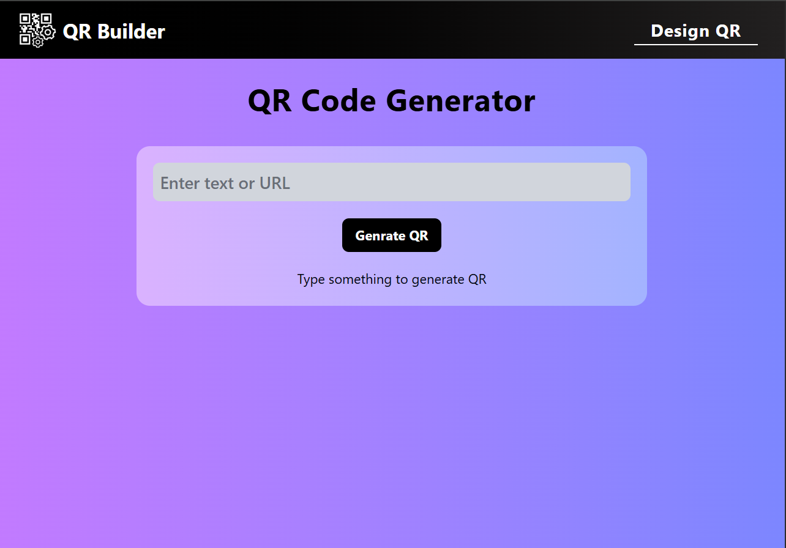
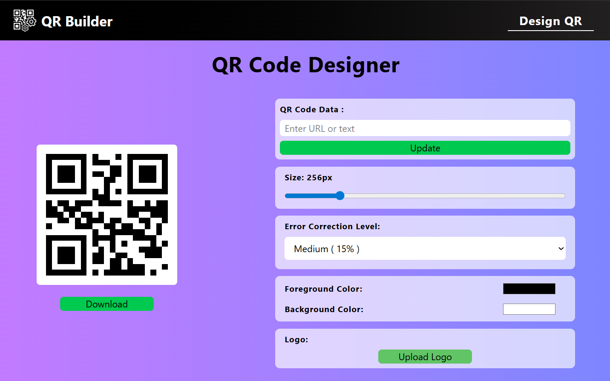

#  QR Builder

[](https://reactjs.org/)

A beautiful, feature-rich QR code generator built with React. Create stunning, customizable QR codes with logos, and various styling options, all in your browser!

🏆 This repository is part of **Open Source 101**, organised by **ISTE HIT SC**.

## ✨ Features

- 🎨 **Custom Colors** - Choose any foreground and background colors
- 🖼️ **Logo Integration** - Add your brand logo to QR codes
- 📏 **Adjustable Size** - Generate QR codes from 200px to 500px
- 🔧 **Error Correction Levels** - L (7%), M (15%), Q (25%), H (30%)
- 💾 **Download as PNG** - Export your QR codes instantly
- ⚡ **Real-time Preview** - See changes as you customize
- 📱 **Responsive Design** - Works on all devices

## 🚀 Demo

👉 [Live Demo](https://qr-generator-silk-five.vercel.app/)

## 📸 Screenshots

| Landing Page | Designing Page | App Logo |
|------|---------------|-----------|
|  |  |  |

## 🛠️ Built With

- [React](https://reactjs.org/) - UI Framework
- [Tailwind CSS](https://tailwindcss.com/) - Styling
- [react-qr-code](https://www.npmjs.com/package/react-qr-code) - QR Code Generation
- [qrcode.react](https://www.npmjs.com/package/qrcode.react) - QR Code Generation
- [Lucide React](https://lucide.dev/) - Icons
- [Vite](https://vitejs.dev/) - Build Tool

## 📋 Prerequisites

Before you begin, ensure you have the following installed:
- **Node.js** `v18.0.0` or higher
- **npm** `v8.0.0` or higher
- **Git**

## 🔧 Installation

1. **Clone the repository**
   ```bash
   git clone https://github.com/yourusername/qr-builder.git
   cd qr-builder
   ```

2. **Install dependencies**
   ```bash
   npm install
   ```

3. **Start the development server**
   ```bash
   npm run dev
   ```

4. **Open the application**
   - Navigate to `http://localhost:5173`

## 📦 Project Structure

```
qr-builder/
├── public/
├── src/
│   ├── assets/
│   │   ├── Favicon.png         # Browser tab icon
│   │   └── LOGO.png            # Application branding logo
│   ├── components/
│   │   ├── Navbar.jsx          # Top navigation bar component
│   │   └── Footer.jsx          # Footer section component
│   ├── context/
│   │   ├── QrContext.jsx       # Context definition for QR-related global stat
│   │   └── QrStates.jsx        # Context provider handling QR logic and state
│   ├── Pages/
│   │   ├── Design_QR.jsx       # QR customization and design page
│   │   └── QRGenerator.jsx     # Main QR generation landing page
│   ├── App.jsx
│   ├── main.jsx
│   └── index.css
├── .gitignore
├── README.md
├── eslint.config.js
├── index.html
├── package-lock.json
├── package.json
└── vite.config.js
```

## 🎯 Usage

### Basic Usage

1. **Enter your data** - Type or paste URL/text in the input field
2. **Customize appearance** - Choose colors
3. **Add logo** (optional) - Upload logos
4. **Adjust settings** - Set size and error correction level
5. **Download** - Click the download button to save as PNG

## 🎨 Customization

### Available Props

| Prop | Default | Description |
|------|---------|-------------|
| `value` | — | Data to encode in QR |
| `size` | 256 | Size of QR code in pixels |
| `level` | "M" | Error correction: L, M, Q, H |
| `fgColor` | "#000000" | Foreground color |
| `bgColor` | "#ffffff" | Background color |
| `imageSettings` | null | Logo configuration |

## 🤝 Contributing

### How to Contribute

1. **Fork the Project**
   - Fork this repository to your own GitHub account.

2. **Set up the Project**
   - Follow the Installation steps above to install dependencies and start the dev server.

3. **Create your Feature Branch**
   - Create a new branch with a clear and descriptive name.
   ```bash
   git checkout -b feature/AmazingFeature
   ```

4. **Make Your Changes**
   - Follow the existing project structure
   - Keep components reusable and readable
   - Ensure imports are case-sensitive
   - Do not introduce build or lint errors

5. **Commit your Changes**
   ```bash
   git commit -m 'Add some AmazingFeature'
   ```

6. **Push to the Branch**
   ```bash
   git push origin feature/AmazingFeature
   ```

7. **Open a Pull Request**
   - Open a Pull Request against the main branch
   - Clearly explain what changes were made and why
   - Attach screenshots for UI-related updates

### Contribution Guidelines

- Do not commit node_modules or submit broken builds.
- Do not push directly to main or modify configuration files without justification.
- Write clear, concise commit messages
- Update documentation if needed
- Test your changes before submitting

### Ideas for Contributions

- 🎨 Add gradient features
- 📱 Improve mobile responsiveness
- 🎭 Add QR code pattern styles (rounded dots, etc.)
- 📊 Add QR code analytics
- 🎯 Add templates for common use cases
- ♿ Improve accessibility
- 📖 Improve documentation


## 👨‍💻 Author

**Abhi Aditya**

- GitHub: [@AbhiAditya02](https://github.com/AbhiAditya02)
- LinkedIn: [Abhi Aditya](https://www.linkedin.com/in/abhi-aditya-504b2a2bb/)

## ⭐ Show Your Support

If you found this project helpful, please give it a ⭐️!

## 📧 Contact

Have questions? Feel free to reach out:
- Email: abhiaditya0755@gmail.com
- Open an issue: [Issues](https://github.com/AbhiAditya02/QRBuilder/issues)

---

<div align="center">

**Built with ❤️ • Feel free to fork & customize! 💜**

 Open Source | [View Demo](https://qr-generator-silk-five.vercel.app/)
</div>
